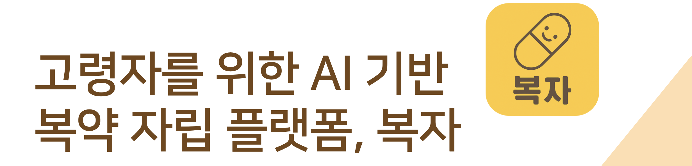
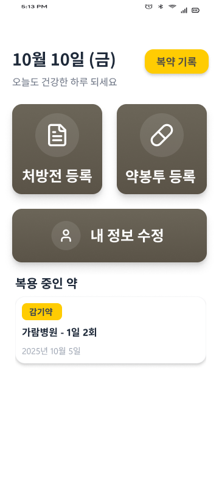
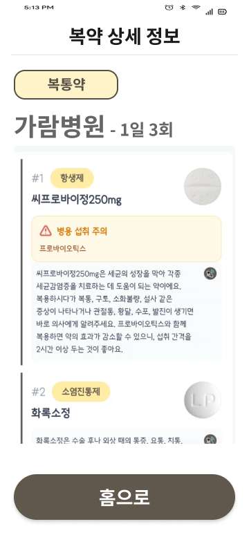
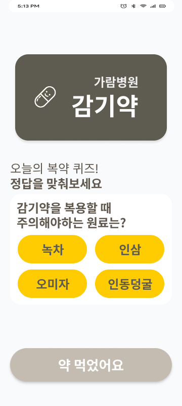
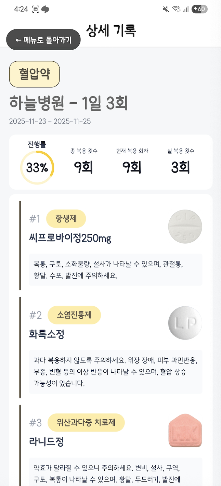
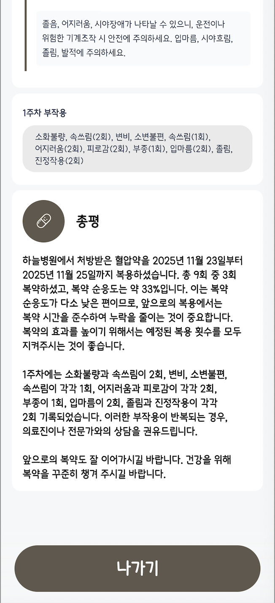

## 2025-2-CCD-1-Synergy-02

## 0. 팀 구성

| 구분 | 성명   | 역할                | 소속학과      | 연계전공        | 이메일 |
|------|--------|---------------------|---------------|-----------------|--------|
| 팀장 | 조혜림 | 프론트엔드 개발        | 융합보안학과      | 융합소프트웨어   | [johyerim@dgu.ac.kr](mailto:johyerim@dgu.ac.kr) |
| 팀원 | 김하늘 | 프론트엔드, 백엔드 개발  | 통계학과         | 융합소프트웨어   | [lkylky020607@gmail.com](mailto:lkylky020607@gmail.com) |
| 팀원 | 박민혁 | 프론트엔드 개발        | 산업시스템공학과   | 융합소프트웨어   | [mhptx7365@gmail.com](mailto:mhptx7365@gmail.com) |
| 팀원 | 황서영 | 백엔드 개발           | 통계학과         | 융합소프트웨어   | [seoyeonghwang@dgu.ac.kr](mailto:seoyeonghwang@dgu.ac.kr) |

## 1. 프로젝트 소개

**복자(Bokja)**는 고령자의 복약 이해와 복약 순응도를 높여 복약 자립을 지원하기 위한 스마트 케어 서비스입니다.
**퀴즈형 알람**으로 복약 이해도를 높이고, **OCR**을 통해 처방전과 약봉투를 찍기만 하면 자동으로 복약 정보가 등록되는 편리함을 제공합니다.

## 2. 주요 기능

### 2-1) 처방전 & 약봉투 OCR 자동 등록
- 카메라로 처방전이나 약봉투를 촬영하면 OCR을 통해 정보가 추출됩니다.
- 병원명, 약 종류, 복용 횟수 등을 자동으로 분석하여 복약 스케줄을 등록합니다.

### 2-2) 복약 알림 (Full Screen & Banner)
- 복약 시간이 되면 화면이 꺼져 있어도 **풀스크린 알림**과 배너 알림이 뜹니다.
- 알림 시 **복약 관련 퀴즈**를 제공하여, 복약 이해도를 향상시킵니다.
- 3회 이상 오답 시 AI 전화가 연결되어 약품 설명을 음성으로 다시 한번 제공합니다. 

### 2-3) 음성 안내 (TTS) & 돋보기 UI
- 작은 글씨가 힘든 어르신을 위해 텍스트를 **음성(TTS)**으로 읽어줍니다.
- 직관적이고 큰 버튼과 핀치줌을 통해 고령자 맞춤 UI/UX를 구성했습니다.

---

## 3. 기술 스택 (Tech Stack)

### Frontend (App)
| Tech | Detail |
| :--- | :--- |
| **Framework** | React Native |
| **Language** | TypeScript |
| **State Mgt** | Zustand |
| **Notification** | Notifee, Firebase Cloud Messaging (FCM) |
| **Network** | Axios |

### Backend (Server)
| Tech | Detail |
| :--- | :--- |
| **Framework** | Spring Boot |
| **Language** | Java 17, Python |
| **Database** | MySQL, JPA |
| **Infra** | AWS EC2, RDS |
| **CI/CD** | GitHub Actions, Docker, Docker Compose |
| **OCR/AI** | Naver Clover OCR, OpenAI GPT 4o, Google Cloud Text-to-Speech |

---

## 4. 실행 화면

| 메인 홈 화면 | 처방전 분석 완료 (OCR) | 복약 알림 | 복약 리포트 |
| :---: | :---: | :---: | :---: |
|  |  |  |   |

[시연영상](https://youtu.be/-ii90K2NkUs)  

